<div align="center">

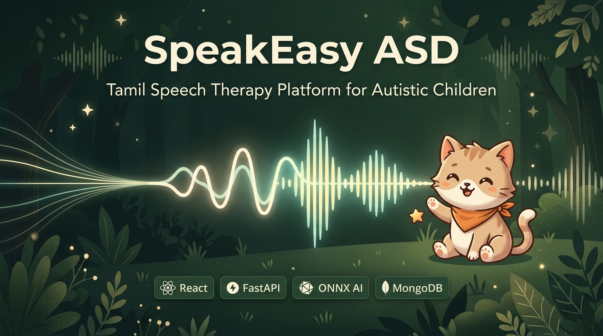

# SpeakEasy ASD / ASD-Edge-ST

**Tamil-first speech-practice, vowel assessment, and care-coordination software for autistic children, caregivers, and speech therapists.**

SpeakEasy ASD is a final-year engineering project from **Team 96, Amrita Vishwa Vidyapeetham**. It combines a React learning experience, a FastAPI speech-analysis backend, MongoDB-backed care workflows, and local acoustic models for Tamil vowel and phoneme practice.

[](https://github.com/9059Rohith/ASD-NEW/actions/workflows/ci.yml)


[Live App](https://speakeasy-asd.vercel.app/) ·
[Demo Video](https://drive.google.com/file/d/197BPWe0lJUPVj7FZEGVJoeGsAxcJABX7/view?usp=sharing) ·
[GitHub](https://github.com/9059Rohith/ASD-NEW) ·
[Architecture](docs/CURRENT_ARCHITECTURE.md) ·
[Application Audit](docs/APPLICATION_AUDIT_2026-09-14.md)

</div>

> **Clinical boundary:** this project is an assistive practice and progress-tracking tool. It is not a diagnostic device, medical device, or replacement for a licensed speech-language pathologist.

---

## Contents

- [Live Demo](#live-demo)
- [Demo Video](#demo-video)
- [Final UI Demo](#final-ui-demo)
- [Screenshots](#screenshots)
- [Problem](#problem)
- [Solution](#solution)
- [Features](#features)
- [How It Works](#how-it-works)
- [Architecture](#architecture)
- [AI / ML Pipeline](#ai--ml-pipeline)
- [Integrations](#integrations)
- [Technology Stack](#technology-stack)
- [Technical Deep Dive](#technical-deep-dive)
- [Project Structure](#project-structure)
- [Run Locally](#run-locally)
- [Environment Variables](#environment-variables)
- [Deployment](#deployment)
- [Testing](#testing)
- [Security & Privacy](#security--privacy)
- [Known Limitations](#known-limitations)
- [Roadmap](#roadmap)
- [Evaluate in 3 Minutes](#evaluate-in-3-minutes)
- [License](#license)

---

## Live Demo

[**Try the deployed frontend**](https://speakeasy-asd.vercel.app/)

Verification note: the Vercel frontend responded successfully on **2026-09-19**. The configured Render API hostname (`speakeasy-asd-api.onrender.com`) returned `404` for public health routes during the same check, so backend-dependent live workflows may require the Render service to be reviewed or run locally.

## Demo Video

[](https://drive.google.com/file/d/197BPWe0lJUPVj7FZEGVJoeGsAxcJABX7/view?usp=sharing)

The supplied Google Drive demo link responded successfully on **2026-09-19**.

## Final UI Demo

These are the latest captured UI states from `images_final_ui_demo/`, including the butterfly animation layer and final Tamil learning flow.

| Home Experience With Butterfly Layer | Learn Tamil Letters |
|---|---|
| 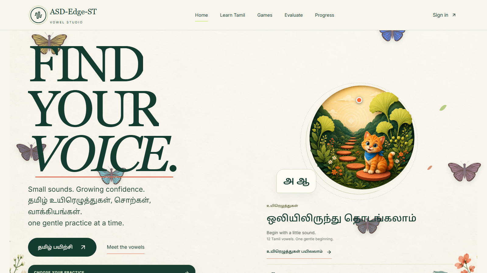 | 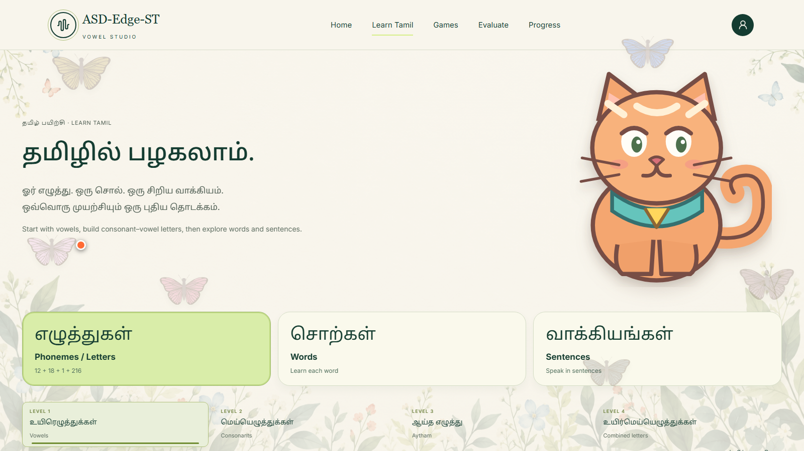 |

| Tamil Words | Tamil Sentences |
|---|---|
| 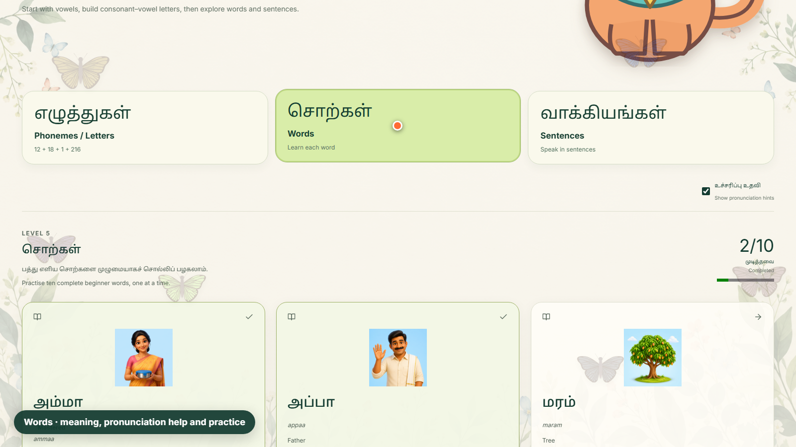 | 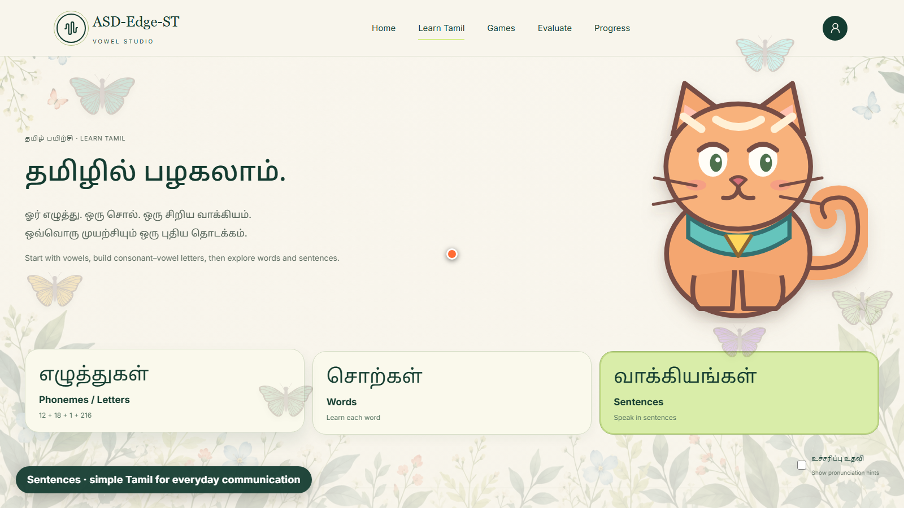 |

| Recognition Challenge | Pronunciation Score |
|---|---|
| 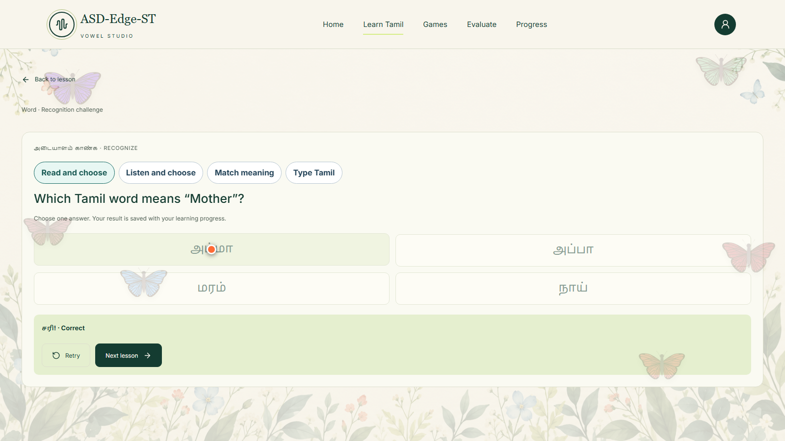 | 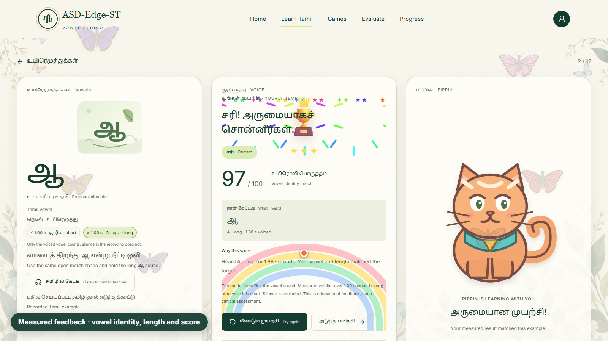 |

## Screenshots

### Tamil Learning And Practice

| Learn Tamil | Practice Result |
|---|---|
| 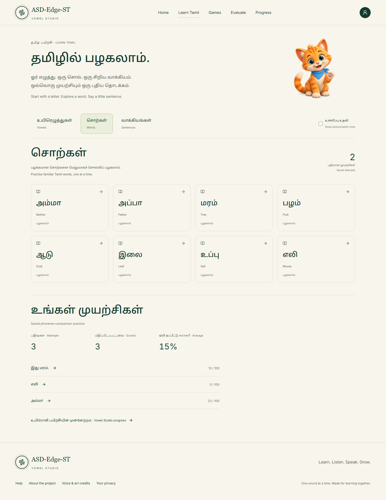 | 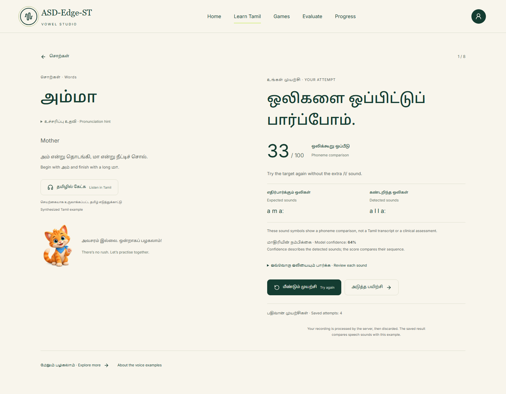 |

### Vowel Studio

| Vowel Home | Evaluation |
|---|---|
| 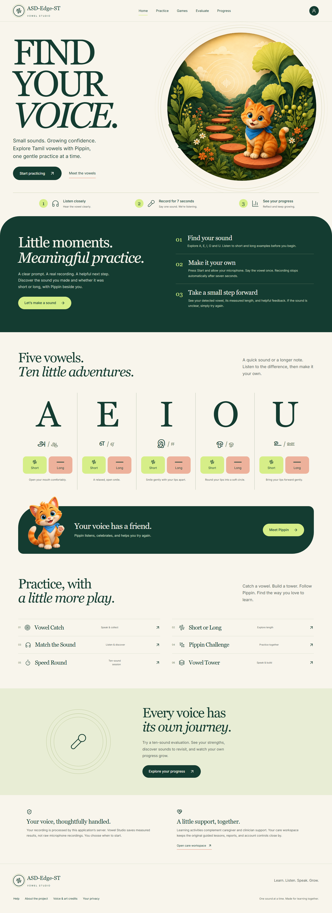 | 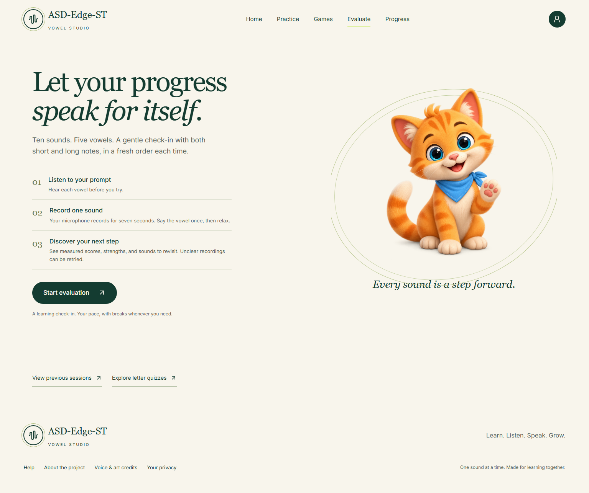 |

### Interactive Child Experience

| Play Hub | River Rescue |
|---|---|
| 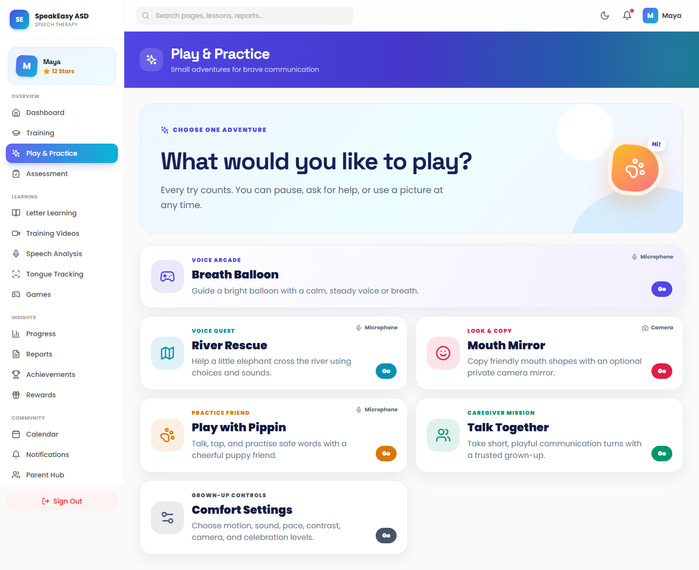 | 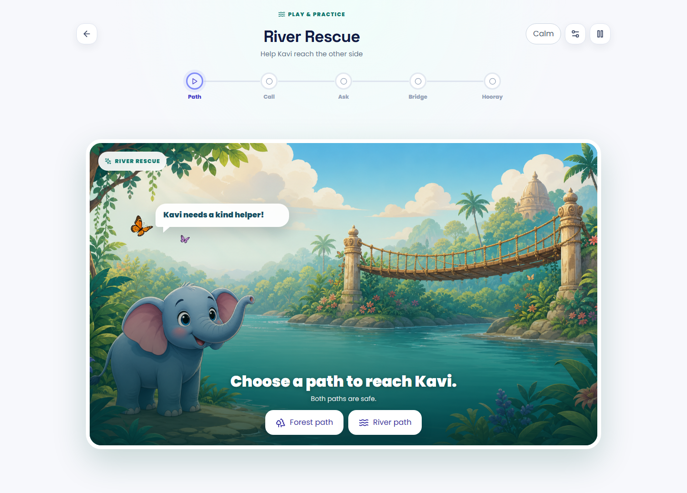 |

### Care Team Views

| Caregiver Dashboard | Therapist Review |
|---|---|
| 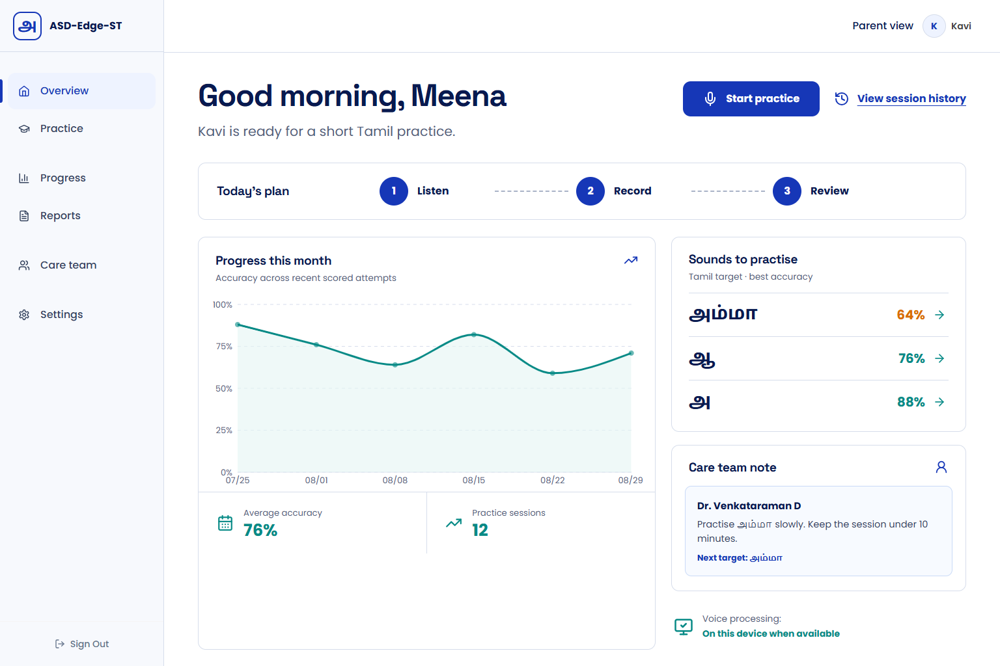 | 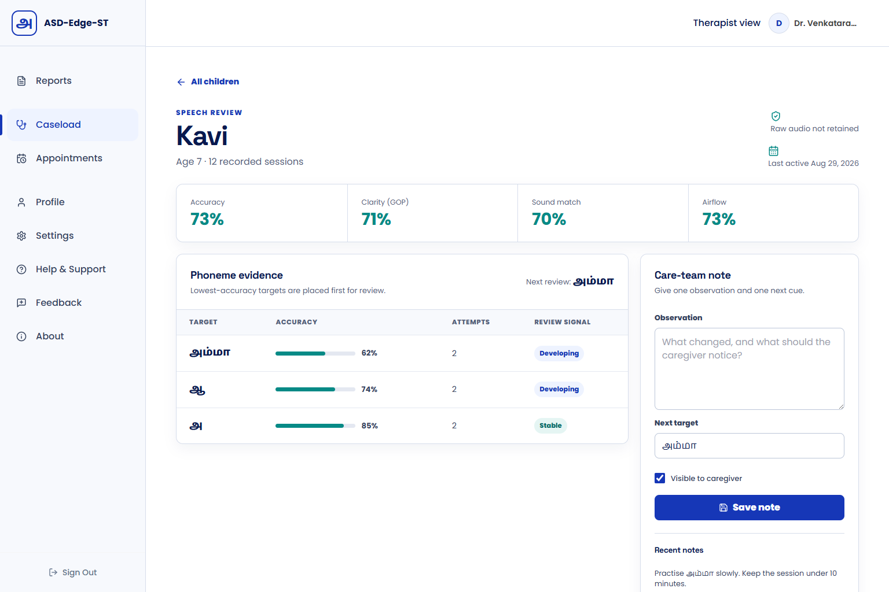 |

## Problem

Tamil-speaking autistic children often have to use speech-practice tools that are not built for their language, sensory needs, or care context.

The project addresses four concrete gaps:

| Gap | Why it matters |
|---|---|
| Tamil coverage | English-first speech tools do not evaluate Tamil vowels, words, and beginner sentences well. |
| Sensory design | Many learning apps use busy feedback, surprise motion, or dense screens that can overwhelm children. |
| Privacy | Child voice recordings need strict handling, consent, and minimal retention. |
| Care coordination | Caregivers and therapists need shared progress evidence, appointments, notes, and reports. |

## Solution

SpeakEasy ASD turns Tamil speech practice into a guided, measurable care loop:

1. A learner opens a calm Tamil lesson, game, or vowel-practice session.
2. The frontend records a short bounded audio attempt with microphone cleanup and retry states.
3. FastAPI validates the request, decodes and resamples audio, and applies quality gates.
4. Local acoustic models score supported vowel, diphthong, word, or sentence targets.
5. The backend stores safe attempt metadata, progress aggregates, consent records, and clinical workflow data in MongoDB.
6. Caregivers and therapists review progress through dashboards, reports, appointments, notes, and consent controls.

## Features

### Tamil Learning

- Tamil catalog covering **12 vowels**, **18 consonants**, **216 consonant-vowel letters**, **1 aytham symbol**, **10 beginner words**, and **8 beginner sentences**.
- Tamil script, transliteration, meanings, pronunciation tips, and approved reference audio where available.
- Recognition and game routes for letter matching, listening choices, picture-word matching, and word-building.
- Spaced review metadata based on saved correct/incorrect attempts.

### Speech And Vowel Scoring

- Seven-second guided recording flow for vowel practice.
- Local MFCC-based vowel identity classifier for A/E/I/O/U families.
- Separate measured-duration logic for short vs. long vowel practice.
- Auxiliary diphthong handling for `ai` and `au` targets.
- Local Wav2Vec2 phoneme recognizer through ONNX Runtime for supported words and sentences.
- Safe result whitelisting before persistence so raw model internals are not returned or stored as user-facing evidence.

### Interactive Practice

- Breath Balloon, River Rescue, Mouth Mirror, Pippin practice, and Talk Together activities.
- Comfort settings, reduced-motion support, calmer progress feedback, and predictable one-action-at-a-time flows.
- Real microphone lifecycle management: stream cleanup, timers, request IDs, and explicit error states.

### Care Coordination

- Parent/caregiver dashboard, therapist dashboard, admin routes, appointments, progress pages, saved reports, and clinical notes.
- Consent ledger for optional recording retention, clinician sharing, and deidentified research.
- CSV report export with formula-injection guarding.
- Daily Tamil report service with optional email/WhatsApp configuration.

## How It Works

```text
Child / Caregiver / Therapist
        |
        v
React + Vite frontend
        |
        | HTTPS, cookies, bearer tokens for supported clients
        v
FastAPI routers
        |
        | auth, Tamil catalog, vowel sessions, reports, consent, dashboards
        v
Audio validation and business rules
        |
        +--> Vowel classifier / diphthong classifier
        +--> Wav2Vec2 ONNX phoneme recognizer
        +--> Optional Tamil transcription fallbacks if configured
        |
        v
MongoDB records
        |
        v
Progress, feedback, reports, appointments, clinical notes
```

## Architecture

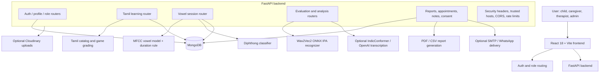

## AI / ML Pipeline

| Component | Purpose | Verified implementation |
|---|---|---|
| Vowel classifier | Identify isolated A/E/I/O/U vowel family | `backend/app/services/vowel_analysis.py`, `backend/models/vowel-classifier/` |
| Duration rule | Separate short vs. long practice attempts | Voiced-duration measurement, not whole recording length |
| Diphthong classifier | Detect `ai` / `au` and avoid forcing them into paired vowel scoring | `backend/app/services/diphthong_analysis.py` |
| Phoneme recognizer | Produce broad IPA phones for supported word/sentence targets | Quantized `facebook/wav2vec2-lv-60-espeak-cv-ft` ONNX artifacts |
| Tamil STT fallback | Grade recognized Tamil text for word/sentence targets when configured | IndicConformer service and optional OpenAI transcription service |

Measured model reports are documented in:

- [Vowel Model Report](docs/VOWEL_MODEL_REPORT.md)
- [Diphthong Model Report](docs/DIPHTHONG_MODEL_REPORT.md)
- [Vowel Studio Completion Report](docs/VOWEL_STUDIO_COMPLETION_REPORT.md)

## Integrations

| Integration | Purpose | Configuration |
|---|---|---|
| MongoDB / MongoDB Atlas | Users, attempts, sessions, consent, progress, appointments, notes | `MONGODB_URL`, `DB_NAME` |
| Cloudinary | Optional durable media/avatar upload storage | `CLOUDINARY_*` |
| SMTP | Optional doctor/care-team report delivery | `SMTP_*` |
| WhatsApp Business Cloud API | Optional report delivery channel | `WHATSAPP_*` |
| Azure Speech | Optional Tamil voice configuration | `AZURE_SPEECH_*`, `TAMIL_SPEECH_VOICE` |
| IndicConformer | Optional Tamil transcription service | `INDICCONFORMER_*` |
| OpenAI transcription | Optional server-side Tamil transcription fallback | `OPENAI_API_KEY`, `OPENAI_TRANSCRIPTION_MODEL` |
| Render | Docker backend deployment target | `render.yaml` |
| Vercel | Static frontend deployment and `/api` rewrites | `frontend/vercel.json` |

## Technology Stack

| Layer | Technology |
|---|---|
| Frontend | React 18, Vite 8, React Router, Zustand, TanStack Query, Framer Motion, Tailwind CSS, Recharts |
| Backend | FastAPI, Uvicorn, Pydantic v2, PyJWT, bcrypt |
| Database | MongoDB with async access helpers |
| Audio / ML | ONNX Runtime, scikit-learn, NumPy, SciPy, librosa, SoundFile, PyAV, Torch/Torchaudio where needed |
| Testing | Pytest, Vitest, Playwright configuration |
| Deployment | Vercel frontend, Render Docker backend |
| Android client | Kotlin/Gradle app under `SpeakEasyAndroid/` |

## Technical Deep Dive

### Frontend

- `frontend/src/App.jsx` defines public routes, role-gated routes, and lazy-loaded pages.
- Zustand stores authentication, theme, settings, and interaction comfort preferences.
- Tamil learning pages separate catalog browsing, quiz recognition, games, practice, and progress.
- Audio capture utilities manage microphone streams, WAV encoding, request lifecycle, and cleanup.

### Backend

- `backend/app/main.py` wires 60+ routers into a single FastAPI service.
- Startup connects MongoDB, seeds only environment-configured admins, and warms speech/vowel models in background tasks.
- Settings enforce stricter production constraints for JWT secrets, cookies, CORS, trusted hosts, MongoDB, and development-code exposure.
- Audio routes bound upload sizes and content types, apply rate limits, and whitelist public result fields.

### Data Flow Example

```text
Learner opens /tamil/practice/letter-aa
        |
Frontend loads target metadata and starts a bounded recording
        |
Audio is sent to /api/tamil/practice with item ID and request ID
        |
Backend validates user, audio type, size, and target
        |
Vowel model decodes audio, detects speech, extracts MFCC features, measures duration
        |
Result is normalized into safe fields: score, confidence, quality, feedback
        |
Attempt is saved once; duplicate request IDs return the existing result
        |
Progress aggregates update and the learner receives gentle feedback
```

## Project Structure

```text
.
├── backend/                    # FastAPI API, routers, models, ML services, tests
│   ├── app/
│   │   ├── routers/             # Auth, Tamil, vowels, reports, consent, dashboards...
│   │   ├── services/            # Acoustic models, transcription, reports, progress
│   │   ├── utils/               # JWT, rate limiting, Mongo helpers
│   │   └── tamil_curriculum.py   # Authored Tamil learning catalog
│   ├── models/                  # Vowel, diphthong, and phoneme artifacts
│   └── tests/                   # Pytest suite
├── frontend/                    # React/Vite web application
│   ├── src/
│   ├── tests/                   # Playwright specs
│   └── vercel.json              # Frontend deployment rewrites and headers
├── SpeakEasyAndroid/            # Kotlin Android client
├── docs/                        # Architecture, audits, model reports, QA screenshots
│   ├── assets/                  # README poster and screenshot assets
│   └── qa/                      # Verified UI screenshots and fidelity ledgers
├── scripts/                     # Local setup/smoke helpers
├── render.yaml                  # Render backend blueprint
└── README.md
```

Reference/imported projects such as `Talky-full-app-main/`, `TalkingPet/`, `aacesstalk-monorepo-main/`, `cboard-master/`, `LiveTalk-Unity/`, and `gandeeva/` are present in the repository, but the current browser product is centered on `frontend/`, `backend/`, `SpeakEasyAndroid/`, and `docs/`.

## Run Locally

### 1. Clone

```bash
git clone https://github.com/9059Rohith/ASD-NEW.git
cd ASD-NEW
```

### 2. Backend

```bash
cd backend
python -m venv .venv
.venv\Scripts\activate
pip install -r requirements-dev.txt
copy .env.example .env
python -m uvicorn app.main:app --reload
```

The backend defaults to `http://127.0.0.1:8000`. For full persistence, run MongoDB locally or point `MONGODB_URL` to a MongoDB Atlas database.

### 3. Frontend

```bash
cd frontend
npm ci
copy .env.example .env.local
npm run dev
```

The frontend defaults to `http://localhost:5173`.

### 4. Android

```bash
cd SpeakEasyAndroid
.\gradlew.bat testDebugUnitTest
```

## Environment Variables

Backend variables are documented in [backend/.env.example](backend/.env.example). The most important groups are:

| Group | Variables |
|---|---|
| App/runtime | `APP_ENV`, `TRUSTED_HOSTS`, `CORS_ORIGIN`, `CORS_ORIGINS`, `MAX_UPLOAD_BYTES` |
| Database | `MONGODB_URL`, `DB_NAME`, `MONGODB_TLS_ALLOW_INVALID_CERTIFICATES` |
| Auth | `JWT_SECRET_KEY`, `JWT_ALGORITHM`, `ACCESS_COOKIE_NAME`, `COOKIE_SECURE`, `COOKIE_SAMESITE` |
| Admin seed | `ADMIN_EMAIL`, `ADMIN_PASSWORD` |
| Speech models | `PHONEME_MODEL_ID`, `PHONEME_ONNX_PATH`, `INDICCONFORMER_*`, `OPENAI_*` |
| Storage/delivery | `CLOUDINARY_*`, `SMTP_*`, `WHATSAPP_*`, `AZURE_SPEECH_*` |

Frontend variables are documented in [frontend/.env.example](frontend/.env.example). For local Vite proxy/Vercel rewrites, `VITE_API_BASE_URL=/api` is used.

## Deployment

### Frontend

- Hosted target: Vercel
- Verified URL: [https://speakeasy-asd.vercel.app/](https://speakeasy-asd.vercel.app/)
- Config: [frontend/vercel.json](frontend/vercel.json)
- Behavior: static SPA fallback, security headers, and `/api/*` / `/health/*` rewrites to the backend host.

### Backend

- Hosted target: Render Docker web service
- Config: [render.yaml](render.yaml)
- Health path in config: `/health/live`
- Public verification on **2026-09-19**: `https://speakeasy-asd-api.onrender.com/health/live` returned `404`.

Because the frontend is live but the public backend health route was not reachable during verification, evaluators should use the local setup for backend-dependent scoring if the hosted API is still unavailable.

## Testing

Latest local verification on **2026-09-19**:

| Check | Result |
|---|---|
| Backend tests | `python -m pytest -q` completed successfully; 380 tests collected. Warnings were deprecations/version warnings, not failures. |
| Frontend unit tests | `npm test -- --run` passed: 64 files, 302 tests. |
| Frontend lint | `npm run lint` passed. |
| Frontend production build | `npm run build` passed with Vite chunk-size warnings only. |
| Live frontend link | `https://speakeasy-asd.vercel.app/` returned HTTP 200. |
| Demo video link | Google Drive demo URL returned HTTP 200. |
| Public backend health | Render URL returned 404 during verification. |

## Security & Privacy

Implemented security/privacy mechanisms visible in the codebase:

- JWT sessions with `HttpOnly` cookie support and bearer-token support for compatible clients.
- Production validation for JWT secret strength, secure cookies, explicit HTTPS CORS origins, trusted hosts, and remote MongoDB settings.
- Security headers middleware plus Vercel security headers.
- Rate limits on audio and answer endpoints.
- Audio upload size and MIME checks.
- Append-only consent records for optional data uses.
- Result whitelisting for acoustic evidence and bounded API response fields.
- CSV export formula-injection guard.
- Default Tamil/vowel analysis paths process raw audio in memory and persist derived results, not raw recordings.

## Known Limitations

- Public backend health could not be verified on Render during the latest README check.
- The app is an educational/practice aid, not validated clinical diagnostic software.
- Word and sentence phoneme scoring uses broad IPA alignment; it is not a full clinical pronunciation assessment.
- Duration scoring estimates voiced vowel duration and cannot prove every articulation detail of a held sound.
- Optional services such as Cloudinary, SMTP, WhatsApp, Azure Speech, IndicConformer, and OpenAI transcription require server-side credentials and configuration.
- Some repository folders are reference/imported projects and are not part of the primary browser runtime.
- No root `LICENSE` file is present.

## Roadmap

- [x] React web app with Tamil learning, vowel studio, games, and dashboards
- [x] FastAPI backend with authentication, MongoDB persistence, reports, consent, appointments, and acoustic scoring routes
- [x] Local vowel, diphthong, and phoneme-analysis services
- [x] Vercel frontend deployment
- [x] Render backend deployment configuration
- [ ] Restore/verify public backend health endpoint on Render
- [ ] Add a root open-source license file if the team intends public reuse
- [ ] Add deployment status monitoring and README badge once the hosted backend is stable
- [ ] Expand validated Tamil word/sentence acoustic benchmarks
- [ ] Document production operations runbook for model artifacts and environment setup

## Evaluate in 3 Minutes

1. Open the [live frontend](https://speakeasy-asd.vercel.app/) to see the product shell.
2. Watch the [demo video](https://drive.google.com/file/d/197BPWe0lJUPVj7FZEGVJoeGsAxcJABX7/view?usp=sharing).
3. Review the [architecture diagram](#architecture) and [AI / ML pipeline](#ai--ml-pipeline).
4. Inspect the core code:
   - [frontend/src/App.jsx](frontend/src/App.jsx)
   - [backend/app/main.py](backend/app/main.py)
   - [backend/app/routers/tamil.py](backend/app/routers/tamil.py)
   - [backend/app/routers/vowels.py](backend/app/routers/vowels.py)
   - [backend/app/services/vowel_analysis.py](backend/app/services/vowel_analysis.py)
   - [backend/app/services/phoneme_pipeline.py](backend/app/services/phoneme_pipeline.py)
5. Run the local tests from [Testing](#testing).

## Documentation

- [Current Architecture](docs/CURRENT_ARCHITECTURE.md)
- [Application Audit](docs/APPLICATION_AUDIT_2026-09-14.md)
- [Deployment Notes](docs/DEPLOYMENT.md)
- [Tamil Learning API](docs/TAMIL_LEARNING_API.md)
- [Tamil Language Research](docs/TAMIL_LANGUAGE_RESEARCH.md)
- [Vowel API Contract](docs/VOWEL_API_CONTRACT.md)
- [Vowel Model Report](docs/VOWEL_MODEL_REPORT.md)
- [Diphthong Model Report](docs/DIPHTHONG_MODEL_REPORT.md)
- [Security Threat Model](docs/security/interactive-experience-threat-model.md)

## Contributing

1. Fork the repository and create a feature branch.
2. Keep product changes scoped to the relevant app area.
3. Run backend and frontend tests before opening a pull request.
4. Do not commit `.env`, credentials, raw child audio, generated build folders, or local logs.
5. Include screenshots or test evidence for UI and workflow changes.

## License

No root license file is currently present in this repository. Until a license is added by the project owners, reuse rights are not granted beyond normal GitHub viewing/forking behavior.
