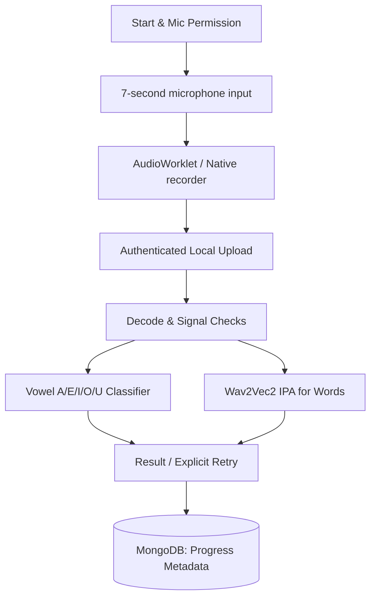

# ASD-Edge-ST / SpeakEasy ASD


> A local-first Tamil speech-practice and care-coordination platform for autistic children, caregivers, and speech therapists.

[🎥 Demo Video](https://drive.google.com/file/d/197BPWe0lJUPVj7FZEGVJoeGsAxcJABX7/view?usp=sharing) | [💻 GitHub](https://github.com/9059Rohith/ASD-NEW) | [📖 Architecture](docs/CURRENT_ARCHITECTURE.md)

*(Note: Live deployment is currently offline/pending as per the deployment config, please run locally!)*

## 💡 Problem

Autistic children in Tamil-speaking regions often lack access to specialized, language-specific speech therapy tools that cater to their unique developmental needs. Existing tools are frequently not localized for the Tamil language, require constant high-speed internet (problematic in some areas), or process sensitive voice data on third-party cloud servers, raising significant privacy concerns for caregivers and therapists.

## 🚀 Solution

**SpeakEasy ASD** solves this by providing a localized, gamified, and local-first speech practice environment. The application runs a robust local backend with on-device acoustic evaluation and phoneme scoring, ensuring no sensitive audio ever leaves the user's control without explicit consent. It provides a cohesive loop between the child (learner), the caregiver, and the speech therapist.

## ✨ Key Features

### 🎮 Child-Centric Learning
- **Tamil Phoneme & Vowel Practice**: Interactive lessons for 12 vowels, 18 consonants, and 216 combined letters.
- **Pippin the Companion**: An SVG-animated companion that reacts to the child's voice and progress, supporting reduced-motion preferences.
- **7-Second Practice Blocks**: Bounded audio capture designed to prevent sensory overload and frustration.

### 🛡️ Privacy & Local-First AI
- **On-Device Inference**: Uses local ONNX models for Wav2Vec2 IPA recognition and a specialized Vowel Classifier.
- **Audio Privacy**: Float WAV samples are processed in memory and immediately discarded.
- **Offline Capable AI**: Core speech analysis functions independently of external cloud transcription services.

### 👥 Care Coordination
- **Caregiver & Therapist Dashboards**: Dedicated workspaces to track progress, adjust learning paths, and schedule appointments.
- **Idempotent Progress Tracking**: Reliable tracking of completed exercises, streaks, and mastery without duplicate data entries.

## 🧠 How It Works



## 🖼️ Application

### Caregiver Dashboard


### Pippin Learning Interface


### Interactive Exercises


## 🤖 AI / ML Architecture

- **Vowel Classifier**: A paired classifier utilizing gain-independent MFCC statistics for A/E/I/O/U detection. Accompanied by a duration model to differentiate short vs. long vowels.
- **Phoneme Recognizer**: Quantized local `facebook/wav2vec2-lv-60-espeak-cv-ft` exported to ONNX format. It provides exact phoneme edit alignment without requiring external APIs, ensuring complete data privacy.
- **Diphthong Artifact**: Secondary detector to prevent gliding vowels from receiving false-positive paired-vowel scores.

## 🛠️ Technology Stack

| Layer | Technology |
|---|---|
| **Frontend** | React 18, Vite, Zustand, Tailwind CSS, Framer Motion |
| **Backend** | FastAPI, Python 3.11+, ONNX Runtime |
| **Database** | MongoDB (6+ or Atlas) |
| **Mobile** | Kotlin, Jetpack Compose (Android) |
| **AI / ML** | Wav2Vec2 (ONNX), Joblib (Scikit-Learn), PyTorch |

## 📁 Project Structure

```text
.
├── backend/             # FastAPI source, local AI models, and tests
├── frontend/            # React/Vite source and public assets
├── SpeakEasyAndroid/    # Kotlin/Compose native Android application
├── docs/                # Architecture, audits, and product design docs
│   └── assets/          # Application screenshots and images
└── scripts/             # Setup and deployment utilities
```

## ⚙️ Installation

### Prerequisites
- Python 3.11+
- Node.js 20+
- MongoDB 6+ (Running locally)

### 1. Clone the Repository
```bash
git clone https://github.com/9059Rohith/ASD-NEW.git
cd ASD-NEW
```

### 2. Backend Setup
```powershell
cd backend
python -m venv venv
.\venv\Scripts\Activate.ps1
pip install -r requirements-core.txt
python scripts/download_phoneme_model.py
cp .env.example .env # Configure your MongoDB URL here
python -m uvicorn app.main:app --reload --host 0.0.0.0 --port 8000
```

### 3. Frontend Setup
```powershell
# In a new terminal
cd frontend
npm install
npm run dev
```
Access the application at `http://localhost:5173`.

## 🔐 Environment Variables

A `.env.example` file is provided in the `backend` directory. 
Required keys include:
- `MONGODB_URL`: Your local or Atlas connection string.
- `JWT_SECRET_KEY`: Used for authentication.
- `APP_ENV`: Set to `development` for local testing.

*No API keys for external LLMs are required, as inference is entirely local.*

## 🧪 Testing

The platform maintains a rigorous test suite to ensure reliability and safety.
- **Frontend**: Vitest and Playwright (106/107 cases passing). Run with `npm test`.
- **Backend**: Pytest suite covering all API endpoints and acoustic analysis paths. Run with `pytest -q`.
- **Android**: `testDebugUnitTest` passes locally.

## ⚠️ Known Limitations
- Vowel and phoneme scoring models are not clinical diagnostic tools. They serve as practice aides.
- Freehand handwriting recognition is not yet implemented.
- The 9-word and 8-sentence beginner set is foundational; a broader curriculum expansion is planned.
- Local ASR fallback (IndicConformer) requires heavy NeMo dependencies and is currently marked as optional/unavailable by default.

## 👀 Evaluate in 3 Minutes

1. **Watch**: The [Demo Video](https://drive.google.com/file/d/197BPWe0lJUPVj7FZEGVJoeGsAxcJABX7/view?usp=sharing) for an end-to-end view.
2. **Inspect**: The `backend/app/services` folder to see the local Python/ONNX ML inference implementation.
3. **Read**: The [Architecture Guide](docs/CURRENT_ARCHITECTURE.md) to understand the privacy-first design.
4. **Run**: Use the provided installation commands to spin up the React frontend and FastAPI backend instantly.

## 📄 License
Check the repository for specific licensing terms regarding the source code and ML models. Generative audio samples carry a non-commercial license.
