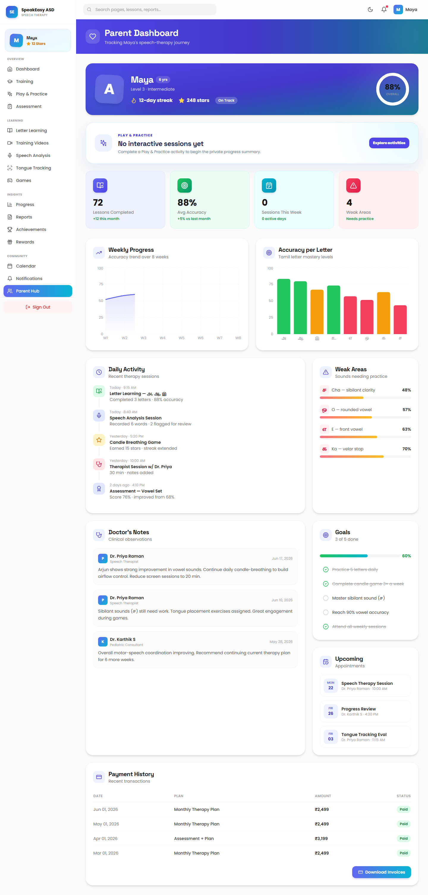
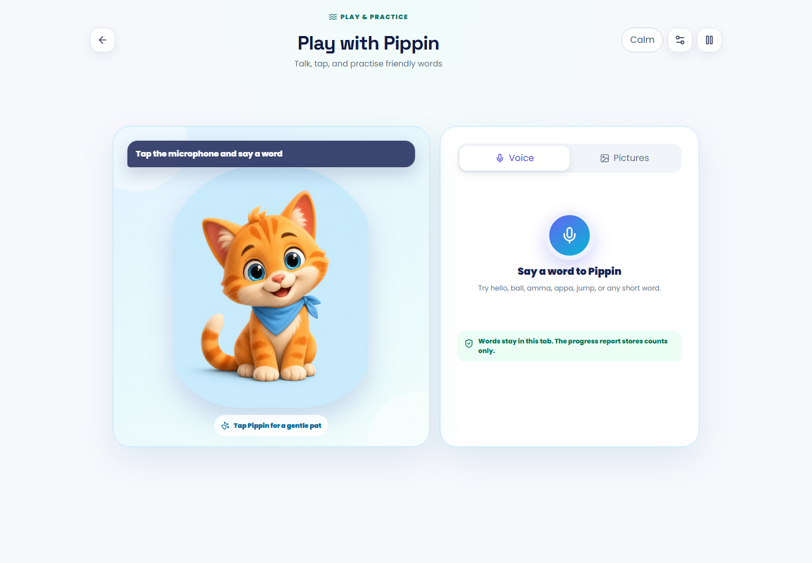
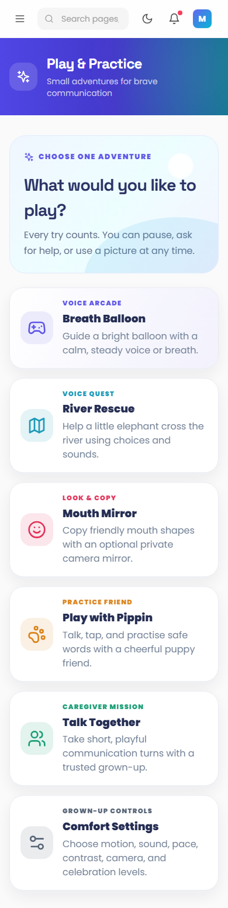
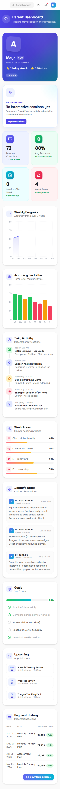
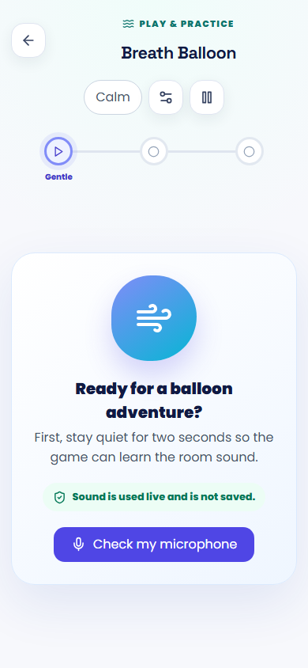
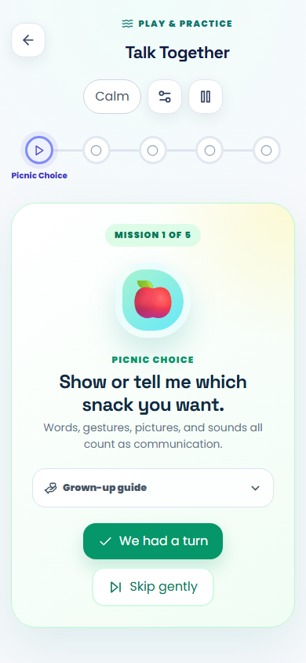
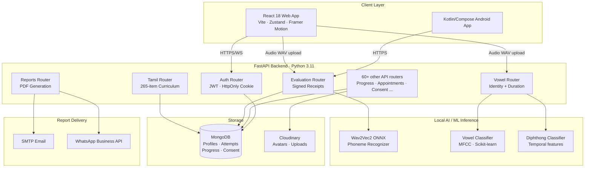

<div align="center">


# SpeakEasy ASD — ASD-Edge-ST

**A local-first Tamil speech-practice and care-coordination platform for autistic children, caregivers, and speech therapists.**

Built at **Amrita Vishwa Vidyapeetham** as a Final Year Project — Team 96.

[](https://github.com/9059Rohith/ASD-NEW/actions/workflows/ci.yml)
[](https://www.python.org/)
[](https://react.dev/)
[](https://fastapi.tiangolo.com/)
[](https://www.mongodb.com/)
[](./README.md)

[🎥 **Demo Video**](https://drive.google.com/file/d/197BPWe0lJUPVj7FZEGVJoeGsAxcJABX7/view?usp=sharing) &nbsp;·&nbsp;
[💻 **GitHub**](https://github.com/9059Rohith/ASD-NEW) &nbsp;·&nbsp;
[🏗️ **Architecture**](docs/CURRENT_ARCHITECTURE.md) &nbsp;·&nbsp;
[📖 **API Docs**](http://localhost:8000/docs) &nbsp;·&nbsp;
[📋 **Audit Report**](docs/APPLICATION_AUDIT_2026-09-14.md)

</div>

---

## Table of Contents

- [Overview](#-overview)
- [Demo Video](#-demo-video)
- [Screenshots](#-screenshots)
- [The Problem](#-the-problem)
- [The Solution](#-the-solution)
- [Key Features](#-key-features)
- [How It Works](#-how-it-works)
- [System Architecture](#-system-architecture)
- [AI / ML Pipeline](#-ai--ml-pipeline)
- [Integrations](#-integrations)
- [Technology Stack](#-technology-stack)
- [Technical Deep Dive](#-technical-deep-dive)
- [End-to-End Workflow Example](#-end-to-end-workflow-example)
- [Project Structure](#-project-structure)
- [Installation & Setup](#-installation--setup)
- [Environment Variables](#-environment-variables)
- [Deployment](#-deployment)
- [Testing](#-testing)
- [Security](#-security)
- [Known Limitations](#-known-limitations)
- [Roadmap](#-roadmap)
- [Evaluate in 3 Minutes](#-evaluate-in-3-minutes)
- [Documentation](#-documentation)
- [Contributing](#-contributing)

---

## 💡 Overview

**SpeakEasy ASD** is a full-stack, privacy-first speech practice platform designed specifically for Tamil-speaking autistic children and the care teams that support them. It runs a trained on-device AI pipeline — no child's voice is sent to a third-party cloud unless the caregiver explicitly consents.

The platform serves three distinct user roles:

| Role | What they do |
|---|---|
| **Child / Learner** | Practise Tamil phonemes, vowels, words and sentences through guided 7-second recording loops, games, and Pippin's animated companionship |
| **Caregiver / Parent** | Manage consent, review progress, schedule appointments, and receive PDF reports |
| **Speech Therapist / Clinician** | Inspect IPA phoneme evidence, assign next practice targets, add clinical notes |

> **Important:** This is an assistive practice aid — not a diagnostic device or a replacement for a licensed speech-language pathologist.

---

## 🎥 Demo Video

<div align="center">

[](https://drive.google.com/file/d/197BPWe0lJUPVj7FZEGVJoeGsAxcJABX7/view?usp=sharing)

*Full walkthrough: caregiver onboarding → child Tamil practice → real acoustic scoring → clinician review*

</div>

---

## 🖼️ Screenshots

<table>
  <tr>
    <td align="center"><b>Home / Landing Page</b></td>
    <td align="center"><b>Caregiver Dashboard</b></td>
  </tr>
  <tr>
    <td></td>
    <td></td>
  </tr>
  <tr>
    <td align="center"><b>Pippin Practice Interface</b></td>
    <td align="center"><b>Interactive Exercises</b></td>
  </tr>
  <tr>
    <td></td>
    <td></td>
  </tr>
</table>

### Mobile UI

<table>
  <tr>
    <td align="center"><b>Home (Mobile)</b></td>
    <td align="center"><b>Caregiver (Mobile)</b></td>
    <td align="center"><b>Breath Exercise (Mobile)</b></td>
    <td align="center"><b>Together Mode (Mobile)</b></td>
  </tr>
  <tr>
    <td></td>
    <td></td>
    <td></td>
    <td></td>
  </tr>
</table>

---

## ❗ The Problem

Autistic children in Tamil-speaking communities face a specific gap: **language-specific, accessible, and privacy-respecting speech therapy tools simply do not exist** for them.

The existing landscape fails in three ways:

1. **Language gap:** Mainstream speech apps (English-centric) are useless for Tamil-first families. Pronunciation scoring models don't understand Tamil phoneme structure.
2. **Privacy risk:** Cloud-based speech analysis sends children's voice data to remote servers, bypassing GDPR/DPDP protections and caregiver consent.
3. **Interaction design:** Generic apps overwhelm autistic children — surprise animations, timed pressure, noisy feedback, and unpredictable UI layouts cause sensory distress and reduce engagement.

---

## 🚀 The Solution

SpeakEasy ASD delivers a **local-first, ASD-adapted Tamil speech therapy pipeline**:

```
Problem                     →  Solution                         →  Outcome
─────────────────────────────────────────────────────────────────────────────
No Tamil phoneme scoring    →  On-device Wav2Vec2 IPA model     →  Instant, private scoring
Cloud privacy risks         →  Audio processed & discarded      →  No raw audio leaves device
Sensory overload in apps    →  ASD UX rules: 1 action at a time →  Calm, predictable practice
No care team coordination   →  3-role platform + PDF reports    →  Therapist-caregiver loop
```

---

## ✨ Key Features

### 🎓 Tamil Language Learning
- **265-item curriculum**: 12 vowels (உயிரெழுத்துக்கள்), 18 consonants (மெய்யெழுத்துக்கள்), 1 aytham (ஃ), 216 combined letters (உயிர்மெய்), 10 words, 8 sentences
- **Guided practice pages** with Tamil script, transliteration, and local human-recorded audio examples
- **Recognition challenges**: character recognition, listening challenges, meaning matching, sentence ordering, typed Tamil writing
- **Spaced repetition review queue** (1 → 3 → 7 → 14 → 30 days) based on answer history
- **Short/long vowel discrimination** using acoustic voice duration measurement

### 🤖 On-Device AI Scoring
- **Vowel identity classifier**: MFCC-based, gain-independent — detects A/E/I/O/U in isolation
- **Duration classifier**: separates short vs. long vowels via measured voiced-duration
- **Diphthong detector**: independently recognizes ஐ (ai) and ஔ (au) with temporal features
- **Phoneme pipeline**: quantized `facebook/wav2vec2-lv-60-espeak-cv-ft` runs locally via ONNX for word/sentence IPA alignment
- All audio is processed in memory and discarded — **zero raw audio retention by default**

### 🎮 Interactive Practice Activities
- **Breath Balloon** — diaphragmatic breath control game
- **River Rescue** — sustained phonation / sound activity
- **Mouth Mirror** — articulation placement feedback
- **Pippin** — animated SVG companion that reacts to recording state, results, and blinks naturally
- **Talk Together** — shared screen practice mode
- **6 Tamil Games** across vowels, recognition, construction, ordering, writing, listening

### 👨‍👩‍👧 Care Coordination
- **Caregiver dashboard**: session calendar, progress overview, upcoming appointments
- **Therapist dashboard**: caseload management, phoneme evidence review, clinical notes with next-practice cues
- **Appointment booking** with session history
- **Consent management**: append-only audit log, independent raw-audio sharing toggle
- **Daily PDF reports** — auto-delivered via Email or WhatsApp to nominated doctor (with consent)

### 🔒 Privacy First
- Caregiver controls raw recording retention and sharing independently
- Research exports use pseudonymous identifiers; no names/emails/audio by default
- `HttpOnly` cookie sessions; bearer token support for Android
- Admin approval required for therapist caseload access in production

---

## 🧠 How It Works

### Child Practice Flow

```
Child taps "Start Practice"
         ↓
Target shown in Tamil script + optional transliteration
         ↓
Child records for 7 seconds (auto-stop, no pause/stop button)
         ↓
AudioWorklet float WAV → authenticated HTTPS upload to FastAPI
         ↓
Backend: Decode → Mono 16 kHz resample → Signal quality gate
         ↓
             ┌─────────────────┬──────────────────────┐
         Vowel target      Word/sentence target    Game answer
             ↓                    ↓                    ↓
    Vowel identity        Wav2Vec2 ONNX IPA       Server-graded
    + duration model      alignment + edit score  with idempotency
             └─────────────────┴──────────────────────┘
                                 ↓
              Signed evaluation receipt (cannot be forged by client)
                                 ↓
              Result displayed: expected phones, detected phones,
              substitutions, deletions, insertions, confidence
                                 ↓
              Attempt + derived progress saved to MongoDB
                                 ↓
              Pippin reacts: celebration / gentle retry cue
```

---

## 🏗️ System Architecture



---

## 🤖 AI / ML Pipeline

SpeakEasy ASD uses **three distinct local AI models**, all running on CPU with no external inference API:

### 1. Vowel Identity & Duration Classifier

| Property | Detail |
|---|---|
| **Purpose** | Classify isolated Tamil vowels (A, E, I, O, U) + short/long duration |
| **Architecture** | MFCC feature extraction → Scikit-learn classifier (`classifier.joblib`) |
| **Training data** | Mendeley Tamil vowels-speech database v1 (CC-BY 4.0) — 20 speakers |
| **Features** | Gain-independent MFCCs (c1–c12), voiced-duration from energy + autocorrelation |
| **Measured accuracy** | Identity: **81.90%** · Length: **94.87%** · Combined: **77.48%** (speaker-disjoint eval) |
| **Artifact version** | `tamil-mendeley-v1.1-2026-09-06` |

### 2. Wav2Vec2 Phoneme Recognizer (ONNX)

| Property | Detail |
|---|---|
| **Base model** | `facebook/wav2vec2-lv-60-espeak-cv-ft` |
| **Format** | Quantized ONNX (318 MB), SHA-256 verified on download |
| **Purpose** | IPA phoneme recognition for words and sentences |
| **Scoring** | `100 × max(0, 1 − edit_distance / target_phone_count)` (Levenshtein) |
| **Targets** | 40+ explicit broad Tamil IPA targets authored per curriculum item |
| **Inference** | CPU-only via `onnxruntime`, no GPU required |

### 3. Diphthong Auxiliary Classifier

| Property | Detail |
|---|---|
| **Purpose** | Separately detect ஐ (ai) and ஔ (au); prevent false paired-vowel scores |
| **Architecture** | 7-identity classifier with temporal sound features |
| **Key behaviour** | A confident diphthong detection vetoes paired-vowel scoring |

**What the models explicitly do NOT do:**
- Generate a pass from silence or noise
- Fabricate a score when the model is unavailable
- Stretch or repeat audio to manufacture a match
- Use browser ASR transcripts as acoustic evidence

---

## 🔌 Integrations

| Integration | Purpose | Configuration |
|---|---|---|
| **MongoDB Atlas** | All persistent data: users, attempts, progress, consent, appointments | `MONGODB_URL` env var |
| **Cloudinary** | Avatar images and durable audio uploads (production) | `CLOUDINARY_*` env vars |
| **SMTP (Email)** | Daily PDF report delivery to nominated doctor | `SMTP_*` env vars |
| **WhatsApp Business API** | Alternate daily PDF delivery channel | `WHATSAPP_*` env vars |
| **Azure Cognitive Services** | Optional TTS narration in Tamil (`ta-IN-PallaviNeural`) | `AZURE_SPEECH_*` env vars |
| **OpenAI Transcription** | Optional high-accuracy Tamil STT fallback | `OPENAI_API_KEY` env var |
| **Render** | Docker-based production API hosting | `render.yaml` Blueprint |
| **Vercel** | Static React frontend hosting with SPA fallback | `frontend/vercel.json` |

---

## 🛠️ Technology Stack

| Layer | Technology |
|---|---|
| **Frontend** | React 18, Vite, React Router v6, Zustand, TanStack Query, Framer Motion, Tailwind CSS |
| **Backend** | FastAPI 0.115, Python 3.11, Uvicorn, Pydantic v2 |
| **Database** | MongoDB 6+ (local dev) / MongoDB Atlas (production) |
| **AI / ML** | ONNX Runtime, Scikit-learn, NumPy, SciPy, Librosa, PyAV |
| **Audio** | AudioWorklet (float WAV), MediaRecorder fallback, SoundFile, ffmpeg |
| **Authentication** | PyJWT, bcrypt, HttpOnly cookies (web) + Bearer tokens (Android) |
| **Mobile** | Kotlin, Jetpack Compose, Android SDK 34 |
| **Storage** | Cloudinary (production), local `/uploads` (development) |
| **Reporting** | FPDF2, uharfbuzz (Tamil-capable PDF font shaping) |
| **CI/CD** | GitHub Actions (backend pytest · frontend vitest + build · Android Gradle) |
| **Deployment** | Render (Docker API) + Vercel (frontend) |
| **Containerisation** | Docker, docker-compose (dev) |

---

## 🔬 Technical Deep Dive

### Frontend Architecture

The React app uses **lazy-loaded routes** organized by role access (`caregiver`, `therapist`, `admin`). A `RoleRoute` guard redirects unauthorized access. State is split:

- **Zustand** handles authentication and persisted comfort preferences (reduced-motion, theme, sound levels)
- **TanStack Query** manages server state for progress, appointments, curriculum
- **Each recording session** owns its own `AudioContext`, `AudioWorklet`, encoder, timers, and in-flight XHR — unmounting cancels all resources to prevent leaks

### Backend Architecture

FastAPI is organized into **8 phases of routers** (62 total) covering every domain. Key design decisions:

- **Idempotent attempt saves**: a `request_id` prevents duplicate database writes on retry
- **Signed evaluation receipts**: the server signs each scorable attempt; the client cannot forge a score
- **Async lifespan**: models are warmed up asynchronously (speech model first, then vowel models — sequentially on Windows to avoid native library conflicts)
- **Daily report loop**: a background `asyncio.Task` runs hourly, checking for consented children with due reports

### Audio Processing Pipeline

```
Browser AudioWorklet (float WAV at native rate)
  → HTTPS upload to /api/evaluate or /api/vowels/score
  → soundfile decode OR PyAV fallback (for WebM/Opus from Android)
  → Mono mix → resample to 16 kHz
  → Signal quality gate (energy + voiced-duration check)
  → Model inference
  → Result returned; raw buffer discarded
```

### Tamil Curriculum Engine

The curriculum (`tamil_curriculum.py`) contains 265 items across all categories. Recognition answers use server-graded, NFC-normalized Tamil text comparison. Writing practice accepts equivalent Unicode representations. The spaced-repetition scheduler computes next-due dates from the attempt history (1/3/7/14/30 days).

### Database Design

MongoDB collections:
- `users` — profiles for all roles
- `attempts` — each speech/game attempt with IPA evidence
- `progress` — aggregated mastery per curriculum item
- `appointments` — therapy session scheduling
- `clinical_notes` — therapist annotations
- `consent` — append-only consent audit log
- `report_claims` — delivery state for daily PDF reports

### Security Model

- `HttpOnly`, `Secure`, `SameSite=None` session cookies in production
- `TrustedHostMiddleware` + `SecurityHeadersMiddleware` enforces host and CSP headers
- Production startup fails fast if: local MongoDB, example admin credentials, wildcard CORS, or non-HTTPS origins are detected
- Raw microphone audio is never written to disk; it is analyzed in memory and discarded

---

## 🔄 End-to-End Workflow Example

**Scenario:** A child practises the word **அம்மா (amma)**.

```
1. CAREGIVER  selects "அம்மா" from the word curriculum on /tamil
              ↓
2. FRONTEND   shows Tamil script, human audio example, recording button
              ↓
3. CHILD      taps record → 7 seconds of microphone input captured via AudioWorklet
              ↓
4. FRONTEND   encodes audio as float WAV → POST /api/tamil/practice/amma/score
              ↓
5. BACKEND    decodes WAV → resample 16 kHz mono → signal check (voiced > threshold?)
              ↓
6. ONNX MODEL runs Wav2Vec2 CTC → decodes IPA tokens: e.g., ['a', 'm', 'aː']
              ↓
7. BACKEND    aligns decoded IPA against target ['a', 'm', 'aː'] using Levenshtein
              score = 100 × max(0, 1 − 0/3) = 100  ✓ Perfect match
              ↓
8. BACKEND    creates signed receipt → saves attempt + updates progress in MongoDB
              ↓
9. FRONTEND   shows result: green confirmation, expected vs. detected phones, Pippin celebrates
              ↓
10. THERAPIST reviews attempt evidence in dashboard next session
```

---

## 📁 Project Structure

```text
ASD-NEW/
├── backend/                    FastAPI API server
│   ├── app/
│   │   ├── main.py             App factory: 62 routers, model warmup, lifespan
│   │   ├── config.py           Pydantic-settings environment configuration
│   │   ├── database.py         MongoDB async connection manager
│   │   ├── tamil_curriculum.py 265-item Tamil learning catalog
│   │   ├── routers/            62 API modules (auth, vowels, tamil, reports...)
│   │   ├── services/
│   │   │   ├── phoneme_pipeline.py   Wav2Vec2 ONNX IPA recognizer
│   │   │   ├── vowel_analysis.py     MFCC vowel identity + duration classifier
│   │   │   ├── diphthong_analysis.py ஐ/ஔ temporal classifier
│   │   │   ├── tamil_daily_report.py PDF generation + delivery scheduler
│   │   │   └── reward_engine.py      XP, streaks, badge logic
│   │   └── models/             Pydantic data models
│   ├── models/
│   │   ├── phoneme-onnx/       Wav2Vec2 ONNX checkpoint (downloaded at setup)
│   │   ├── vowel-classifier/   MFCC joblib model + evaluation.json
│   │   └── diphthong-classifier/ Diphthong auxiliary model
│   ├── tests/                  pytest suite (160+ tests)
│   ├── scripts/                download_phoneme_model.py, seed scripts
│   ├── Dockerfile              Production container (Python 3.11-slim + ffmpeg)
│   └── requirements-core.txt
│
├── frontend/                   React 18 / Vite web application
│   ├── src/
│   │   ├── App.jsx             Router + role-gated routes
│   │   ├── pages/              51 page components (all roles)
│   │   ├── features/
│   │   │   ├── tamil/          Tamil learning + practice UI
│   │   │   ├── vowels/         Vowel Studio UI
│   │   │   ├── pippin/         Animated SVG companion
│   │   │   ├── arcade/         Breath Balloon game
│   │   │   ├── quest/          River Rescue game
│   │   │   └── reports/        Caregiver report UI
│   │   ├── store/              Zustand stores (auth, settings)
│   │   └── services/           Axios API client
│   ├── tests/                  Playwright E2E + Vitest unit tests
│   └── vercel.json             SPA fallback + API rewrite headers
│
├── SpeakEasyAndroid/           Kotlin / Jetpack Compose Android client
│   └── app/src/                Tamil script UI, AAC recorder, API client
│
├── docs/                       Architecture, audit, model, and design docs
│   └── assets/                 Screenshots and banner
├── scripts/                    setup-local.ps1, start-local.ps1, smoke-test.ps1
├── render.yaml                 Render Blueprint (production API hosting)
└── .github/workflows/ci.yml   GitHub Actions CI (backend + frontend + android)
```

---

## ⚙️ Installation & Setup

### Prerequisites

| Requirement | Version |
|---|---|
| Python | 3.11+ |
| Node.js | 20+ |
| MongoDB | 6+ running locally |
| Java | 17+ (Android only) |
| Android SDK | 34 (Android only) |

### 1. Clone the Repository

```bash
git clone https://github.com/9059Rohith/ASD-NEW.git
cd ASD-NEW
```

### 2. Automated Local Setup (Recommended — Windows)

```powershell
# One-time setup: creates venv, installs deps, downloads ONNX model (~318 MB)
.\scripts\setup-local.ps1

# Start MongoDB + Backend + Frontend
.\scripts\start-local.ps1
```

Open **http://127.0.0.1:5173** in your browser.

### 3. Manual Setup

#### Backend

```powershell
cd backend
python -m venv venv
.\venv\Scripts\Activate.ps1
pip install -r requirements-core.txt

# Download and verify the ONNX phoneme model (~318 MB)
python scripts/download_phoneme_model.py

# Configure environment
Copy-Item .env.example .env
# Edit .env with your MongoDB URL and JWT secret

# Start the API
python -m uvicorn app.main:app --reload --host 127.0.0.1 --port 8000
```

Verify model readiness: `GET http://localhost:8000/health/speech` → `{"status":"ready"}`

#### Frontend

```powershell
# In a new terminal
cd frontend
npm install
npm run dev
```

#### (Optional) Seed Demo Data

```powershell
cd backend
$env:DEMO_CARE_LOOP_PASSWORD = "DemoCare@123"
python scripts/seed_demo_care_loop.py
```

This seeds a linked caregiver + therapist with scored attempts, consent history, and clinical notes.

---

## 🔐 Environment Variables

Copy `backend/.env.example` to `backend/.env` and fill in the required values:

```env
# Required
APP_ENV=development
MONGODB_URL=mongodb://localhost:27017
DB_NAME=speakeasy_asd
JWT_SECRET_KEY=<generate-a-long-random-secret>
ADMIN_EMAIL=admin@yourdomain.com
ADMIN_PASSWORD=<strong-password>
CORS_ORIGIN=http://localhost:5173

# Optional — Cloud storage (required for production avatars)
CLOUDINARY_CLOUD_NAME=
CLOUDINARY_API_KEY=
CLOUDINARY_API_SECRET=

# Optional — Tamil TTS narration
AZURE_SPEECH_KEY=
AZURE_SPEECH_REGION=centralindia

# Optional — Daily report delivery
SMTP_HOST=
WHATSAPP_PHONE_ID=

# Optional — Enhanced Tamil STT fallback
OPENAI_API_KEY=
```

> ⚠️ Never commit `.env` to version control. The `.gitignore` excludes it.

---

## 🚀 Deployment

### Production Architecture

```
User Browser
    ↓ HTTPS
Vercel (frontend/)
    ↓ /api/* rewrite
Render (backend/ Docker)
    ↓
MongoDB Atlas + Cloudinary
```

### Backend — Render

The `render.yaml` Blueprint provisions the Docker service automatically:

1. Create MongoDB Atlas cluster; allow Render outbound IPs
2. Create Render Blueprint from this repository
3. Set `CORS_ORIGINS`, `MONGODB_URL`, `JWT_SECRET_KEY`, `ADMIN_*`, and `CLOUDINARY_*` secrets
4. Verify: `GET https://speakeasy-asd-api.onrender.com/health/ready`

### Frontend — Vercel

1. Import repo; set project root to `frontend/`
2. Framework: Vite; build command: `npm run build`; output: `dist`
3. Set `VITE_API_BASE_URL=/api`
4. Deploy — `frontend/vercel.json` handles SPA fallback and API proxy

### Android — Release Build

```powershell
cd SpeakEasyAndroid
.\gradlew.bat assembleRelease -PbackendUrl=https://speakeasy-asd-api.onrender.com/
```

### Smoke Test

```powershell
.\scripts\smoke-test.ps1 -WebUrl https://your-app.vercel.app -ApiUrl https://speakeasy-asd-api.onrender.com
```

---

## 🧪 Testing

The platform has three independent test suites:

### Backend (pytest)

```powershell
cd backend
python -m pytest -q
```

**Verified result (6 September 2026):** 160 tests passed across all API routes, phoneme alignment logic, vowel analysis, Tamil text normalization, and speech-text versioning.

### Frontend (Vitest + Playwright)

```powershell
cd frontend
npm test -- --run          # 212 unit tests across 46 files
npm run lint               # ESLint — zero errors
npm run build              # Production build — passes
npx playwright test        # E2E: 106/107 browser journeys passed
```

### Android (Gradle)

```powershell
cd SpeakEasyAndroid
.\gradlew.bat testDebugUnitTest assembleDebug
```

**Verified result:** 6 unit tests pass; debug APK builds successfully.

---

## 🔒 Security

| Mechanism | Implementation |
|---|---|
| **Authentication** | JWT in HttpOnly cookies (web) + Bearer tokens (Android) |
| **Session integrity** | `Secure`, `SameSite=None` cookies in production |
| **Score integrity** | Server-signed evaluation receipts; client-edited scores rejected |
| **Host validation** | `TrustedHostMiddleware` — rejects unexpected `Host` headers |
| **Security headers** | `SecurityHeadersMiddleware` — CSP, X-Frame-Options, etc. |
| **CORS** | Exact-origin allowlist; wildcard rejected in production |
| **Production guards** | Startup fails if local DB, example admin credentials, or wildcard CORS detected |
| **Input validation** | Pydantic v2 on all request bodies; audio size capped at 10 MB |
| **Audio privacy** | Raw audio never written to disk; processed in memory and discarded |
| **Consent audit** | Append-only consent history; deletion requests trigger data purge |
| **Research exports** | Pseudonymous IDs only; no names, emails, or audio |
| **Dependency audit** | `npm audit --omit=dev` runs in CI; zero high/critical vulnerabilities |

---

## ⚠️ Known Limitations

- **Vowel model accuracy is measured, not clinical:** Identity accuracy 81.90%, combined 77.48% on a speaker-disjoint test set. Short O and U have the weakest scores (8/15 and 8/13 correct). Not validated on child speech or across dialects.
- **Phoneme scores are practice estimates:** The Wav2Vec2 model was not trained on Tamil child speech. Broad IPA targets are educational approximations, not phonologically validated sequences.
- **No audio examples for consonants:** The 216 combined-letter lessons offer study and recognition, but no bundled teacher audio for consonants (rights clearance not established for available corpora).
- **IndicConformer is optional/absent:** The NeMo runtime is not included; `/health/speech` explicitly reports Tamil STT as `unavailable` without it.
- **No offline evaluation queue:** The platform requires a network connection for API scoring; there is no local browser-side fallback queue.
- **Playwright full-suite run incomplete:** Concurrent browser-process load on the development machine prevented a full 107-case run in a single batch; all 107 tests have individually passing results.
- **Production Docker not exercised locally:** Docker Desktop Linux engine was unavailable; local Python installation was verified instead.
- **Generated audio carries non-commercial license:** The 17 synthesized Tamil audio examples cannot be commercially redistributed without rights clearance.

---

## 🗺️ Roadmap

```
[x] Tamil vowel identity and short/long duration classifier
[x] Wav2Vec2 ONNX phoneme pipeline for words and sentences
[x] Diphthong (ஐ/ஔ) auxiliary classifier
[x] 265-item Tamil curriculum (vowels, consonants, combined letters, words, sentences)
[x] Spaced-repetition review queue
[x] Caregiver / therapist / admin role separation
[x] Clinical notes with next-practice cues
[x] Idempotent progress tracking and signed receipts
[x] Daily PDF reports (Email + WhatsApp)
[x] Consent management with audit log
[x] Gamified practice: 6 Tamil games + Vowel Studio
[x] Pippin animated SVG companion
[x] Native Android Kotlin/Compose client
[x] Docker + Render + Vercel deployment pipeline
[x] GitHub Actions CI (backend + frontend + Android)
[ ] Teacher audio examples for all 234 consonant/combined-letter items
[ ] Freehand handwriting recognition for Tamil script
[ ] Validated Tamil child-speech benchmark for phoneme model
[ ] Broader beginner curriculum (words, sentences, stories)
[ ] Offline evaluation queue for low-connectivity environments
[ ] iOS client
[ ] Multi-language support beyond Tamil
```

---

## 👀 Evaluate in 3 Minutes

**For judges, recruiters, and evaluators — here is the fastest path:**

### Step 1 — Watch (60 seconds)
▶ [Demo Video](https://drive.google.com/file/d/197BPWe0lJUPVj7FZEGVJoeGsAxcJABX7/view?usp=sharing) — shows the full child practice loop with real acoustic scoring

### Step 2 — Understand the AI (30 seconds)
→ [`backend/app/services/phoneme_pipeline.py`](backend/app/services/phoneme_pipeline.py) — Wav2Vec2 ONNX + Levenshtein IPA scoring  
→ [`backend/app/services/vowel_analysis.py`](backend/app/services/vowel_analysis.py) — MFCC vowel classifier  

### Step 3 — Read the Architecture (30 seconds)
→ [docs/CURRENT_ARCHITECTURE.md](docs/CURRENT_ARCHITECTURE.md) — full system and pipeline diagrams

### Step 4 — Verify the Tests
→ 160 backend tests · 212 frontend unit tests · 106/107 Playwright E2E · Android builds  
→ [docs/COMPLETION_REPORT.md](docs/COMPLETION_REPORT.md) — exact verified test results

### Step 5 — Run It Locally (90 seconds)
```powershell
git clone https://github.com/9059Rohith/ASD-NEW.git && cd ASD-NEW
.\scripts\setup-local.ps1   # installs deps + downloads ONNX model
.\scripts\start-local.ps1   # starts MongoDB + API + frontend
# Open http://127.0.0.1:5173
```

---

## 📚 Documentation

| Document | Description |
|---|---|
| [CURRENT_ARCHITECTURE.md](docs/CURRENT_ARCHITECTURE.md) | Full pipeline and storage architecture with Mermaid diagrams |
| [PRODUCT_DESIGN.md](docs/PRODUCT_DESIGN.md) | Role definitions, UX flows, ASD-specific interaction rules, accessibility targets |
| [COMPLETION_REPORT.md](docs/COMPLETION_REPORT.md) | Verified test results and implementation details |
| [APPLICATION_AUDIT_2026-09-14.md](docs/APPLICATION_AUDIT_2026-09-14.md) | Latest full system audit (393 files, 48 routes, live browser verification) |
| [VOWEL_MODEL_REPORT.md](docs/VOWEL_MODEL_REPORT.md) | Vowel classifier provenance, training data, accuracy metrics and limitations |
| [DIPHTHONG_MODEL_REPORT.md](docs/DIPHTHONG_MODEL_REPORT.md) | ஐ/ஔ diphthong classifier design and validation |
| [TAMIL_LANGUAGE_RESEARCH.md](docs/TAMIL_LANGUAGE_RESEARCH.md) | Tamil phonology research, IPA mapping methodology |
| [VOWEL_API_CONTRACT.md](docs/VOWEL_API_CONTRACT.md) | API contract for all vowel scoring endpoints |
| [DEPLOYMENT.md](docs/DEPLOYMENT.md) | Full Render + Vercel + Android release and production checklist |

---

## 🤝 Contributing

1. **Fork** the repository
2. **Create a branch**: `git checkout -b feature/your-feature-name`
3. **Make changes** — follow existing code patterns and add tests
4. **Test**: `python -m pytest -q` (backend) and `npm test -- --run` (frontend)
5. **Open a Pull Request** against `main`

Please ensure your PR:
- Does not commit `.env` files or secrets
- Passes all CI checks (backend tests · frontend lint + build · Android build)
- Does not add fabricated scores, features, or accuracy claims

---

<div align="center">

**Built with care for Tamil-speaking autistic children and their families.**

*Amrita Vishwa Vidyapeetham — Team 96 — Final Year Project 2026*

[⭐ Star this repository](https://github.com/9059Rohith/ASD-NEW) if you found it useful!

</div>
