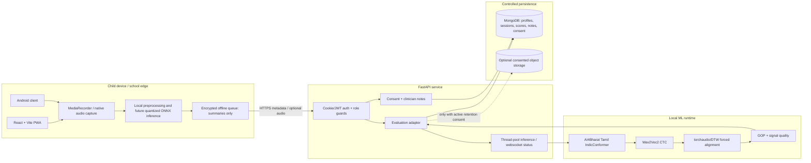
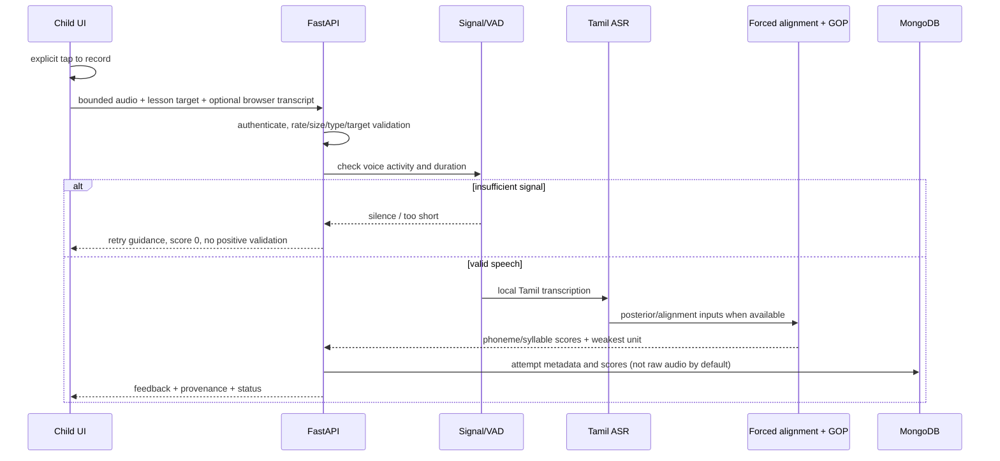

# ASD-Edge-ST Technical Architecture

> Historical design proposal. The implemented pipeline is described in
> [Current application architecture](CURRENT_ARCHITECTURE.md). Offline queues,
> forced alignment and GOP below are design ideas, not current capabilities.

## System overview

The existing React/Vite frontend, FastAPI API, MongoDB store, Android client and Wav2Vec2/forced-alignment/GOP pipeline are retained. The rebuild formalizes them as a local-first, provenance-aware care platform.



## Frontend

- **Framework:** React 18 + Vite. It matches the current application, supports a lightweight offline shell, and avoids a migration that does not improve the clinical workflow.
- **Routing:** React Router with lazy-loaded public, caregiver, therapist and admin routes. Route guards enforce `user`, `therapist`, and `admin` boundaries.
- **Server state:** TanStack Query/axios for API resources. Zustand remains for authentication, sensory preferences, theme and active child-session state.
- **Audio:** `MediaRecorder` captures a short bounded attempt. The browser normalizes format metadata and submits `multipart/form-data`. No continuous background microphone access.
- **Offline:** static curriculum and authored exemplars are cacheable. Result summaries can queue locally; raw audio is not placed in general local storage.
- **Design system:** calm indigo/teal palette, white primary canvas, dark navy text, 8-point spacing, 14/16 px control/body text, 44 px minimum targets, 12–20 px radii, outline icons, restrained shadows, no uncontrolled gradients in child practice.

## Backend

- **API:** FastAPI with Pydantic request models, `UploadFile` size/content checks, thread-pool inference, role dependencies and rate limits.
- **Authentication:** HttpOnly cookie for the web; bearer token compatibility for Android. Passwords use bcrypt. Production CORS and trusted hosts are explicit.
- **Scoring adapter:** the existing `SpeechEvaluator` remains the compatibility boundary. It validates voice activity, tries the local Tamil recognizer, falls back to Wav2Vec2 CTC, performs forced-alignment/GOP when available, and returns a normalized result with validation status/source.
- **Persistence:** raw evaluation outputs are stored as append-only attempt records. Aggregate progress is derived; clinician notes and consent events are separate collections.
- **Failure behavior:** model warm-up is asynchronous. An unavailable recognizer produces `recognizer_unavailable`, not a fabricated positive score. HTTP failures return a calm retry action and do not persist partial attempts.

## Scoring data flow



## Persistence model

| Collection | Key fields | Index / lifecycle |
|---|---|---|
| `users` | email, password hash, role, caregiver/child profile, therapist link | unique email; child profiles scoped to caregiver account |
| `evaluations` | user, lesson, target, accuracy, GOP/MFCC/airflow, syllables, weakest unit, validation source/status, time | `(user_id, created_at desc)`; no raw audio by default |
| `progress` | user, lesson, completion, stars, latest summary | unique/lookup by user + lesson |
| `consent_records` | user, purpose, granted, policy version, actor, time | append-only `(user_id, created_at desc)` |
| `clinical_notes` | child, therapist, text, next target, visibility, time | `(child_id, created_at desc)`; assigned therapist/admin only to write |
| `interactive_sessions` | aggregate turn/success/assistance counts, duration | strict schema; no child media/emotion labels |
| `audit_logs` | actor, action, target, metadata, time | append-only; no voice/transcript content |
| `deletion_requests` | user, state, reason, timestamps | operational queue; cascaded deletion procedure |

MongoDB migrations are additive scripts/index creation because the store is document-based. New fields remain backward-compatible with existing demo and user documents.

## Edge deployment strategy

### Current production path

1. Browser/Android captures a short attempt.
2. A FastAPI service runs beside the school/clinic device or on an approved private server.
3. IndicConformer and Wav2Vec2/GOP run locally in that environment; only score metadata is synchronized to shared MongoDB.
4. When disconnected, the client retains curriculum and queues non-audio result summaries.

### Browser inference path

1. Export the acoustic/CTC model to ONNX with static 16 kHz mono input and validate numerical parity.
2. Quantize only after a child-Tamil validation set meets agreed error bounds.
3. Run with ONNX Runtime Web: WebGPU when supported, WASM fallback otherwise, inside a Web Worker.
4. Cache versioned model assets through the service worker with integrity metadata.
5. Keep forced alignment/GOP server/edge-box side until browser operator support and latency are proven.

### Performance budgets

- record-control response: <100 ms;
- local UI feedback during processing: <100 ms;
- warm edge scoring target for a 1–3 second utterance: p95 <1.5 s on school hardware;
- server fallback target: p95 <3 s excluding first model cold start;
- first model load is explicit and never disguised as a scored attempt.

These are engineering targets, not claims; release gates require measurements on the Sree Taarikaa deployment hardware.

## Privacy and security controls

- Purpose-specific consent separates transient scoring, optional recording retention, clinician sharing and de-identified research.
- Local/transient scoring is the default. Stored audio and transcripts are disabled by default.
- TLS in transit; managed encryption at rest; secret values supplied through deployment configuration.
- Least-privilege role guards, assigned-child checks, short-lived tokens/cookies, rate limits and audit events.
- Export and deletion cover every child-linked collection and optional media object.
- Logs exclude raw audio, child transcript, names and model input.
- Retention jobs delete optional audio at its configured deadline and remove orphaned media.
- Production legal review must confirm COPPA/DPDP notices, lawful basis, parental verification, retention, incident response and processor agreements.

## Deployment and CI/CD

```text
GitHub Actions
├── backend: pytest + dependency/security checks + Docker build
├── frontend: Vitest + ESLint + Vite build + Playwright smoke/accessibility
├── Android: Gradle unit tests + assembleDebug
└── deploy after protected-branch approval
    ├── frontend → Vercel/static host
    ├── API → Render/private clinic edge Docker host
    ├── MongoDB → Atlas/private MongoDB
    └── optional consented audio → private object storage with lifecycle rules
```

The public cloud deployment is a demonstration path. The clinical recommendation is a school/clinic-managed edge API with outbound score synchronization and no raw voice egress.
