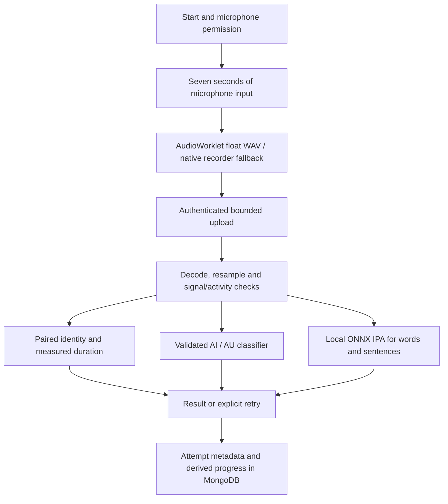

# Current application architecture

`frontend/` is React 18/Vite with React Router, Zustand, Axios, TanStack Query
and Framer Motion. `backend/` is FastAPI with MongoDB and local Python/ONNX
inference. `SpeakEasyAndroid/` is the existing Kotlin client; the current
experience pass targets the browser application and shared API.

## Application and references

Talky, TalkingPet, AACessTalk, Cboard, LiveTalk-Unity and gandeeva are reference
projects, not browser runtime dependencies. Existing Pippin SVG, audio echo and
character states were reused. Unity talking-head generation is not needed.

Public home, credits and authentication routes need no session. Learn Tamil
(`/tamil`, also `/training`), practice, games, evaluation, progress and the
playroom use the learner role. Caregiver, therapist and administrator workspaces
keep their role boundaries. Web sessions use an HttpOnly cookie; bearer tokens
remain supported for clients. The development demo uses the same learner routes
and evaluation APIs. It does not bypass recording or generate successful results.

Zustand holds authentication and saved comfort preferences. Each recording
lifecycle owns its microphone stream, AudioContext, encoder, animation frame,
timers and in-flight request. Changing targets or leaving cancels the instance
and releases resources. Request identifiers prevent duplicate saved attempts
when an upload is retried.

## Microphone and analysis

Recording ends automatically after seven seconds without a Stop button in the
vowel flow. The float WAV path preserves quiet samples at the actual input
sample rate; native MediaRecorder is the fallback. The microphone meter uses a
logarithmic display scale. Inference never raises pitch, stretches the utterance
or repeats it to manufacture a match.

The paired classifier uses gain-independent MFCC statistics for A/E/I/O/U.
Separate fitted duration models estimate short/long from detected voicing,
excluding surrounding silence. This is a duration estimate: it cannot independently
verify the articulation of an intentionally prolonged short vowel. The requested
target is compared only after recognition.

The auxiliary diphthong artifact is enabled only after its documented validation
criteria pass. It detects gliding vowels separately and can prevent a confident
diphthong from receiving a paired-vowel score. Identity-match points and model
confidence are separate. Model reports contain versions, licenses, speaker
splits and measured limitations.

Words and sentences use a quantized local Wav2Vec2 IPA recognizer and phoneme
edit alignment. These symbols are not Tamil text transcription. Edit points are
not clinical pronunciation accuracy. No independent human Tamil word/sentence
benchmark establishes their quality. The compatibility adapter does not invent
GOP, MFCC-template scores or English-letter transcripts as evidence.

## Storage and failures

MongoDB stores profiles, sessions, attempts, derived progress, appointments,
clinician notes and consent in their respective routes. Vowel and Tamil APIs
discard raw microphone audio after in-memory analysis. Ownership, bounded result
fields and idempotence are enforced server-side. Uncertain recordings receive
retry feedback without fabricated success points.

Unavailable models, invalid audio, blocked microphones, network failures and
failed saves have explicit error states. A root React error boundary provides
reload/home recovery for rendering and lazy-module errors, alongside ordinary
route/API error handling.

## Presentation and accessibility

The learning interface retains its ivory/forest palette and existing kitten
art. Noto Sans Tamil, Inter, Poppins and Space Grotesk are served locally with
SIL licenses. SVG Pippin reacts to actual recording/result state; blink timers
and CSS motion pause when hidden or reduced motion is selected.

Parallax moves bounded decorative layers. Keyboard carousel controls, pause,
saved comfort preferences, OS reduced-motion support, focus states and responsive
layouts accompany the animations. There is no implemented offline evaluation
queue, encrypted browser database or claim of universal microphone accuracy.
