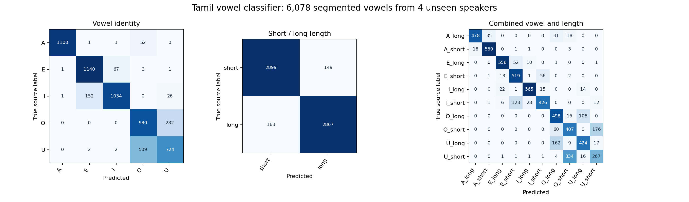

# Vowel model: provenance, evaluation and limitations

This is a local educational classifier for isolated Tamil A, E, I, O and U,
with an independently predicted short/long length. It is not a clinical speech
assessment or a general speech recognizer. Model measurements and final metrics
are recorded in `backend/models/vowel-classifier/evaluation.json`.
Current artifact version: `tamil-mendeley-v1.1-2026-09-06`.

The later [diphthong auxiliary](DIPHTHONG_MODEL_REPORT.md) adds separately trained
ஐ/ஔ recognition and a confident-diphthong veto before paired scoring. The paired
weights and historical measurements below remain unchanged; the auxiliary's
effect on runtime coverage is reported separately. Short/long classification
still uses measured voiced duration and is not independent spectral validation
of an intentionally prolonged short-vowel articulation.

## Data and permission

Source: Revathi Arunachalam, Vijayakrishnan VK, Nandhakumar N and Akilan A (2025),
[Tamil vowels-speech database, version 1](https://data.mendeley.com/datasets/2dnxmvm22k/1),
[DOI 10.17632/2dnxmvm22k.1](https://doi.org/10.17632/2dnxmvm22k.1), licensed
[Creative Commons Attribution 4.0](https://creativecommons.org/licenses/by/4.0/).
The authors do not endorse this application.

The published archive is `Tamil Alphabets.rar`, 1,054,752,738 bytes. Publisher
SHA256: `2f05ccf327bf785cab660cb1ec2832684ed0c1fc9af11c0c14ce8f369f17a068`.
The download script verifies the checksum before extracting. Source archive,
continuous recordings, feature caches and temporary download parts stay in the
ignored `backend/models/vowel-classifier/data/` directory. User microphone audio
is analyzed in memory and is not added to the training data or saved here.

The publication describes twenty speakers and 150 repetitions per vowel. The
archive actually contains continuous per-speaker/per-vowel recordings, not
150 separately labeled clips. Candidate repetitions are segmented automatically.
Observed counts differ from 150; the evaluation inventory records every source
file, accepted segment count and rejection reason. There are no manually labeled
onsets/offsets, so segmentation accuracy is not claimed. At least one WAV is
44.1 kHz despite the page's 16 kHz description; the script resamples input.
Speaker IDs preserve the complete filename prefix preceding `T`; ages are not
inferred from ambiguous filename digits. Directory names supply vowel labels.
The archive also contains nested `train/` and `test/` copies. Only the original
top-level category recordings are used, once each; the publisher's pre-existing
split is not reused or recursively ingested.

We interpret the source's Roman labels as English sound spellings rather than
the application's canonical transliteration. This mapping is inferred from the
complete twelve-category inventory and acoustic checks; the publisher's page
does not provide a Tamil-script mapping table. The explicit mapping is:

| Archive folder | Canonical application target |
|---|---|
| a / aa | a / aa |
| e / ee | i / ii (இ / ஈ) |
| eh / ehh | e / ee (எ / ஏ) |
| o / oo | o / oo |
| u / uu | u / uu |
| i / av | Diphthongs; excluded |

The complete twelve-directory inventory and acoustic checks support this
interpretation. For example, 20 middle-vowel windows from speaker F1047 give
median LPC F1/F2 around 407/2610 Hz in source `e`, compared with 510/2349 Hz
in source `eh`, consistent with high-front /i/ versus mid-front /e/. These
diagnostic estimates are retained in `label-audit.json`; they are not training
labels generated by another recognizer. The paired directory labels supply
short/long ground truth.

## Actual acoustic computation

The decoder accepts bounded WAV, WebM/Opus and other supported audio containers,
downmixes and resamples to 16 kHz. It limits encoded input to 5 MB and decoded
audio to twelve seconds. Seven seconds is the UI capture period, not a class
label or an assumed vowel duration.

With 30 ms frames and a 10 ms step, RMS energy and normalized autocorrelation
identify voiced activity. Gaps of up to approximately 50 ms are closed. Separate
meaningful segments cause a retry. Measured vowel duration runs from the detected
onset to offset, excluding surrounding recording silence. This is a signal-based
voicing detector, not a clinically validated boundary annotator.

Vowel identity uses 80 gain-independent MFCC statistics: mean, standard deviation,
25th and 75th percentiles of coefficients 1–20. It excludes duration and MFCC c0.
Extra Trees and an RBF support vector classifier are compared using validation
speakers. The better validation model is sigmoid calibrated on those validation
speakers.

Length uses a separate logistic model of log measured voiced duration for each
vowel identity. The model uses the **predicted** identity, never the requested
target. Short/long duration boundaries therefore come from labeled human training
recordings, not a manually chosen duration threshold. Both prediction heads run
before target matching. A classifier confidence below 0.60 causes abstention.
Three temporal portions of the vowel must broadly agree on identity; changing
vowels causes a retry. Silence, noise, clipping, multiple segments, invalid audio
and unavailable models never produce a scored attempt.

Version 1.1 adds a training-derived noise gate: the median voiced-frame spectral
flatness must not exceed 0.011625. This is the 99.5th percentile of 600 real
training-speaker segments (five evenly spaced segments per speaker/target
recording). Neither validation nor test speakers set that limit. The gate was
added after a synthetic noise stress check exposed confident errors; the two
classifier heads were preserved and runtime checks were rerun.

The educational score is transparent: identity match earns up to 40 points,
length match up to 30, matching identity confidence up to 20, and within-vowel
identity consistency up to 10. The latter two are acoustic proxies, not separate
clinical pronunciation or consistency assessments. The unchanged weighted
component points are summed, then rounded once to the nearest whole educational
point, with half points rounded upward. For example, 99.79 component points earn
100 educational points and the perfect reward. Confidence retains its fractional
precision: 100 points does not mean 100% model confidence. Confidence is a
calibrated model probability, not a guarantee of correctness. This scoring policy
does not alter vowel predictions, confidence gates, or recognition metrics.

## Evaluation design

A fixed seed, 260906, partitions each gender's ten speaker IDs into six training,
two validation and two test speakers: 12/4/4 speakers in total. Every repetition
from a speaker remains in one partition. Identity candidate selection and
calibration use validation speakers; model fitting uses training speakers. Test
speakers are excluded from both. No synthetic speech, transcript labels or
generated targets are used in the metrics.

The evaluation JSON includes exact speaker IDs, segment counts, per-class
precision/recall/F1 and confusion matrices for identity, length and all ten
combined classes. Confidence-gated coverage is reported alongside accuracy, so
discarded uncertain predictions are visible. Classification metrics refer to
automatically segmented recordings that passed initial signal quality gates,
before learned-flatness, confidence and temporal-consistency abstention; they
do not measure segmentation error against manual boundaries or real-world
microphone success rates.

Reference examples in `references/` come only from **training** speakers. Their
manifest records exact source file/sample boundaries and attribution. Separate
`heldout/` examples come from test speakers for regression/browser checks. Example
selection favors stable, representative, correctly classified clips; the entire
test partition, including errors, remains in the quantitative report. Extracted
clips have been segmented and encoded to PCM16 WAV; no artificial vowel audio
is presented as a human reference.

## Measured results — 6 September 2026

The verified archive supplied 240 original top-level recordings: 200
monophthong recordings were used and 40 diphthong recordings excluded. The
signal gates accepted **29,964** candidate segments and rejected 904 (481
multiple segments, 355 no speech, 66 noisy, 2 clipped). Of the 200 included
recordings, 198 were 16 kHz and two were 44.1 kHz. The nested publisher train/test
copies were excluded.

Extra Trees (400 trees, minimum leaf size 3) won candidate selection: 85.47%
validation identity accuracy before calibration versus 84.09% for the RBF SVM.
After validation-speaker sigmoid calibration, the recorded results are:

| Partition | Speakers | Segments | Identity accuracy | Length accuracy | Both correct |
|---|---:|---:|---:|---:|---:|
| Train | 12 | 18,312 | 99.97% | 90.64% | 90.62% |
| Validation | 4 | 5,574 | 87.44% | 73.34% | 65.39% |
| Test | 4 | 6,078 | **81.90%** | **94.87%** | **77.48%** |

| Test task | Macro precision | Macro recall | Macro F1 |
|---|---:|---:|---:|
| Vowel identity | 83.01% | 82.16% | 82.27% |
| Short/long | 94.87% | 94.87% | 94.87% |
| Ten combined classes | 78.62% | 77.73% | 77.78% |

The confidence-only gate retained **80.55%** of test segments; combined accuracy
on those retained segments was **84.64%**. This is not the final runtime
acceptance rate because the runtime also checks agreement across temporal
portions. Validation scores have participated in model selection/calibration;
test scores have not.

The principal weakness is **O/U confusion**: test recalls were A 95.32%, E
94.06%, I 85.24%, O 77.65% and U 58.53%. There were 282 O→U and 509 U→O errors.
The train/test gap and changing length performance across speaker partitions
show that the model does not generalize uniformly. These results do not support
claims of universally reliable pronunciation grading.

Full per-class precision/recall/F1, raw confusion counts, source inventory,
software versions, artifact SHA256 and speaker IDs are in `evaluation.json`.
The fixed held-out speakers are F1047, F147, M522 and M327. Validation speakers
are F320, F462, M413 and M13; all remaining speaker IDs are training only.

The fitted equal-probability duration boundaries are 0.414s (A), 0.433s (E),
0.436s (I), 0.432s (O) and 0.418s (U), with narrow ambiguous intervals around
each boundary recorded in the evaluation JSON. These values were learned from
this corpus. They are not universal physiological cutoffs or manually assigned
short/long rules.

Verification: eleven focused tests passed, including real held-out audio padded
to a seven-second container and submitted with different requested targets.
Padding preserved the measured vowel duration, and changing the target did not
change either prediction. Ten representative held-out smoke clips, one per
class, were all scorable with correct identity and length; these selected
examples are not used as an estimate of overall accuracy. A separate real
training-reference regression verifies that 99.79 component points earn 100
whole educational points while identity confidence remains 0.9896, and that
changing the requested target leaves the predictions and confidence unchanged.

A separate full-runtime check sampled five source segments per test
speaker/target recording (seed 6092026), for **200 human segments**. It accepted
161 (80.5% coverage); combined accuracy among accepted segments was **83.85%**.
There were 38 ambiguous retries and one unstable-vowel retry. Wrapping every
sample in seven seconds of audio with surrounding silence preserved both
predictions for **200/200** samples, with **0.000s maximum duration difference**.
This directly verifies that the capture window is not used as vowel length.

Corruption checks used one separate source segment per test speaker/target.
With the final v1.1 gate, **40/40 duplicated-vowel recordings, 40/40 heavily
clipped recordings, and 40/40 speech recordings mixed with white noise at
5 dB SNR caused abstention**. Clear-speech coverage and accuracy on the 200
sampled clips stayed unchanged. The earlier gate had scored 33/40 noisy clips,
only nine correctly; that failed audit is retained in
`runtime-evaluation-before-noise-gate.json`. The correction's threshold uses
training speech only. These are targeted engineering checks, not an independent
claim of robustness against all noise types. Synthetic corruptions remain
separate from all human recognition metrics. Full final rows are in
`runtime-evaluation.json`; reproduce with `scripts/vowel_evaluate_runtime.py`.

## Reproduction and limits

From `backend/`, run `.runtime/Scripts/python.exe scripts/vowel_download.py`, then
`.runtime/Scripts/python.exe scripts/vowel_train.py`. Training dependencies match
the backend's NumPy 1.26, SciPy 1.13 and scikit-learn 1.4.2 environment. Downloading
additionally needs `curl_cffi` and `requests`; inference does not.

This small, single-source, repeated-vowel corpus cannot establish accuracy for
speech impairments, all accents, all ages or all microphones. Utterances and
speakers within this corpus are not independent clinical subjects. A long vowel
spoken quickly can overlap a short vowel spoken slowly. Background music or
continuous speech can defeat signal-based gates. The application abstains when
evidence is weak; a complete validation would need independently collected
microphone recordings, manual boundaries and relevant population coverage.
